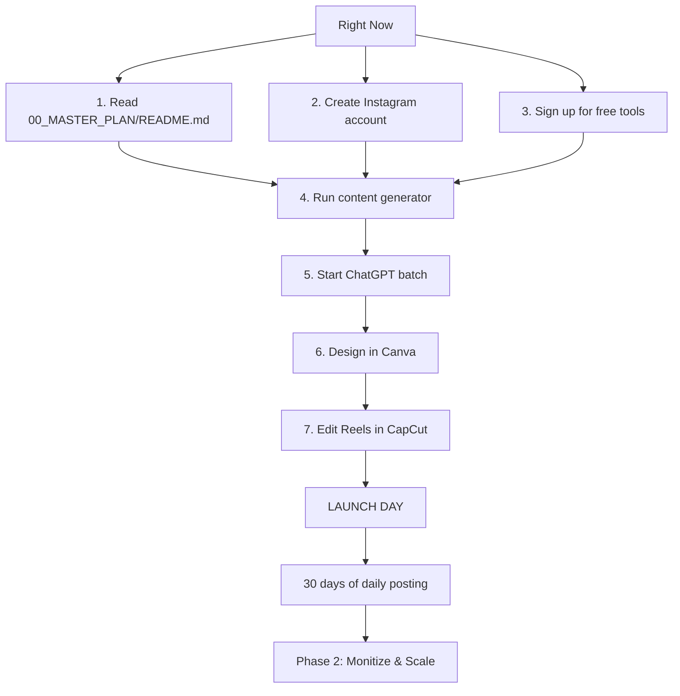

# 🏛️ Stoic Wisdom × Zodiac Signs — Project Index

**Operator**: Marc | **Role**: Elite Content & Automation Operator  
**Phase**: 1 — Basic Setup | **Launch Window**: 30 Days

---

## 📁 Project Structure

```
stoiczodiac/
│
├── INDEX.md                          ← YOU ARE HERE
├── 00_MASTER_PLAN/
│   └── README.md                     ← The core blueprint (start here)
│
├── 01_BRAND_ASSETS/
│   └── brand_guidelines.md           ← Colors, fonts, voice, profile setup
│
├── 02_CONTENT_PILLARS/
│   └── content_pillars.md            ← 6 content pillars with full structures
│
├── 03_CONTENT_CALENDAR/
│   ├── week1_template.md             ← Launch week day-by-day
│   └── generated/
│       ├── content_calendar_20260813.md   ← 60-day calendar
│       ├── week2_20260824.md              ← Week 2 calendar
│       └── ...weekly generated files
│
├── 04_TEMPLATES/
│   ├── canva_setup_guide.md          ← Canva brand kit + 3 templates
│   ├── canva-app/                    ← Canva Developer App (React + Express)
│   ├── carousels/
│   │   └── carousel_template_guide.md  ← 4 carousel templates
│   ├── reels/
│   │   └── reel_template_guide.md      ← 3 reel templates
│   └── stories/
│
├── 05_AI_WORKFLOWS/
│   ├── prompts/
│   │   └── master_prompt_library.md  ← 10 ChatGPT prompts (copy-paste)
│   ├── outputs/                      ← Audio samples, exports
│   └── scripts/
│       ├── batch_content_generator.py   ← Python calendar generator (--week N flag)
│       ├── batch_content_generator.ps1  ← PowerShell version
│       ├── generate_weekly_content.py   ← Sign-quote-application generator
│       ├── generate_carousels.js        ← Carousel asset builder
│       ├── generate_quote_cards.js      ← Quote card builder
│       ├── generate_stories_and_captions.js ← Story/caption generator
│       ├── generate_weekly_forecast.js  ← Weekly forecast builder
│       ├── render_pngs.js              ← PNG render pipeline
│       └── run_weekly_batch.py         ← One-command weekly batch routine
│
├── 06_AUTOMATION/
│   ├── stoic_scheduler/                ← Self-hosted IG auto-poster (Playwright + Meta API)
│   │   ├── scheduler.py                ← Main entry (queue + schedule + post)
│   │   ├── queue_handler.py            ← Folder-based queue management
│   │   ├── meta_api.py                 ← Meta Graph API client
│   │   ├── instagram_bot.py            ← Playwright browser automation
│   │   ├── media_uploader.py           ← Vercel Blob uploads for API posting
│   │   └── config.yaml                 ← Post schedule + folder routing
│   ├── openreply/                      ← DM automation (Next.js app)
│   ├── instagram_dm.py                 ← Instagram DM helper
│   ├── create_campaigns.mjs            ← OpenReply campaign creator
│   └── get_fb_token.html               ← Facebook token guide
│
├── 07_AUDIO/
│   ├── music/                        ← Background music (royalty-free + original)
│   ├── sound_effects/                ← SFX library
│   ├── voiceover_audio/              ← Recorded voiceover files
│   └── voiceover_scripts/
│       └── reel_voiceover_bank.md        ← 15 Reel scripts + production notes
│
├── 08_HASHTAG_LIBRARY/
│   └── hashtag_library.md               ← 150+ tags in 6 groups + formulas
│
├── 09_MONETIZATION/
│   └── monetization_roadmap.md          ← 5-tier monetization plan (Month 2-6)
│
├── 10_ANALYTICS/
│   └── weekly_audit_template.md         ← Weekly audit template + KPIs
│
├── 11_MEDIA_LIBRARY/                    ← All visual media + batch production
│   ├── IMAGES/
│   │   ├── zodiac/{12 signs}/          ← Sign-specific imagery
│   │   ├── backgrounds/                ← Backgrounds, textures, gradients
│   │   ├── quotes/                     ← Designed quote exports
│   │   └── stock/                      ← Licensed stock photography
│   ├── VIDEO/
│   │   ├── reels/                      ← Reel exports
│   │   ├── animations/                 ← Motion graphics, Lottie, GIFs
│   │   ├── b_roll/                     ← B-roll clips
│   │   └── intros_outros/              ← Reel intros + outros
│   ├── GRAPHICS/
│   │   ├── overlays/                   ← Text overlays, stickers, frames
│   │   ├── icons/                      ← Zodiac symbols, social icons
│   │   ├── templates/                  ← Reusable design templates
│   │   └── thumbnails/                 ← Reel/template thumbnails
│   ├── SCREENSHOTS/
│   │   ├── analytics/                  ← Performance screenshots
│   │   └── app_ui/                     ← App interface screenshots
│   └── SCHEDULED/                      ← Weekly batch production folders
│       ├── draft/                      ← In-progress weeks
│       ├── review/                     ← Weeks awaiting QC
│       ├── approved/                   ← QC-passed weeks (ready to queue)
│       ├── week_YYYYMMDD/              ← One per week (auto-created)
│       │   ├── WEEKLY_BATCH_BRIEF.md   ← Sign assignments + pre-filled prompts
│       │   ├── quotes/                 → Drop designed quote images
│       │   ├── reels/                  → Drop reel exports
│       │   ├── carousels/              → Drop carousel exports
│       │   ├── stories/                → Save story texts
│       │   └── captions/               → Save caption texts
│       ├── MASTER_PRODUCTION_TRACKER.md← Progress across all weeks
│       ├── BATCH_PROMPT_CARDS.md       ← Quick-copy AI prompts
│       └── BATCH_HISTORY.md            ← Log of all batch runs
│
├── _ARCHIVE/                            ← Spent/deleted content goes here
└── 05_AI_WORKFLOWS/VibeVoice/           ← Voiceover generator (submodule — replaces ElevenLabs)
```

---

## 🚀 Launch Sequence (30 Days)

### Week 1: Foundation (Days 1–7)
| Day | Action | Files Needed |
|-----|--------|-------------|
| 1 | Create IG account + Canva brand kit | `01_BRAND_ASSETS/brand_guidelines.md` |
| 1 | Generate 12 zodiac avatar images | `04_TEMPLATES/canva_setup_guide.md` |
| 2 | Build 3 Canva templates | `04_TEMPLATES/canva_setup_guide.md` |
| 2 | (Optional) Set up Canva Dev App | `04_TEMPLATES/canva-app/README.md` |
| 2 | Generate 30 quotes via ChatGPT | `05_AI_WORKFLOWS/prompts/master_prompt_library.md` → Prompt 1 |
| 3 | Build hashtag library | `08_HASHTAG_LIBRARY/hashtag_library.md` |
| 4 | Design 30 quote images | Canva template batch |
| 5 | Set up scheduling tool | (optional — Buffer or post manually) |
| 5-6 | Edit 3 Reels | `07_AUDIO/voiceover_scripts/reel_voiceover_bank.md` + CapCut |
| 6 | Set up DM automation (OpenReply) | `06_AUTOMATION/openreply/README.md` |
| **7** | **LAUNCH DAY** | `03_CONTENT_CALENDAR/week1_template.md` |

### Week 2: Build Momentum (Days 8–14)
- Post daily (calendar generated)
- 30 min/day engagement in niche hashtags
- 2 carousels, 3 Reels, 1 weekly forecast
- Track analytics

### Week 3: Growth Systems (Days 15–21)
- Maintain daily posting
- Audit top-5 posts → iterate
- DM automation active
- 3 collab requests

### Week 4: Scale & Optimize (Days 22–30)
- Double down on top formats
- Reels → 5x/week
- Launch first Story poll
- Analytics review
- **Day 30**: Retrospective → Phase 2

---

## 🧰 Free AI Tool Stack Quick Reference

| Tool | Free Tier | Setup Status |
|------|-----------|-------------|
| **ChatGPT** (GPT-3.5) | Unlimited | ✅ Ready |
| **Canva** | 250K+ templates | Needs setup |
| **Leonardo AI** | 150 credits/day | Needs signup |
| **CapCut Desktop** | Full suite | Needs install |
| **VibeVoice** (replaces ElevenLabs) | Self-hosted (free / unlimited) | ✅ Ready — `05_AI_WORKFLOWS/VibeVoice` |
| **Pexels** | Unlimited | ✅ Ready |
| **Stoic Scheduler** | Self-hosted | ✅ Running (auto-poster) |
| **OpenReply** | Self-hosted (free) | ✅ Running (DM automation) |
| **Gumroad** | Free (10% fee) | For PDF sales |
| **Substack** | Free | For newsletter |

---

## 📊 Target KPIs (End of 30 Days)

| Metric | Target | How to Track |
|--------|--------|-------------|
| Followers | 500–1,000 | Instagram Insights |
| Avg. Post Reach | 500+ | Instagram Insights |
| Avg. Reel Views | 1,000+ | Instagram Insights |
| Engagement Rate | 5%+ | `(L+C+S+Sh) / Reach × 100` |
| Story Views | 100+ | Instagram Insights |
| DM Conversations | 50+ | OpenReply Dashboard |
| Saved Posts | 20+/post | Instagram Insights |

---

## ⚡ Where to Start RIGHT NOW



---

## 🏁 Phase 2 Preview (After 30 Days)

- **Scale**: 2 accounts (Stoic × Zodiac + one more niche)
- **Monetize**: PDF journal, readings, affiliate, sponsorships
- **Automate**: Full OpenReply campaigns, auto-DM, content repurposing
- **Grow**: Collab loops, cross-promotion, TikTok expansion

---

**Next action**: Open `00_MASTER_PLAN/README.md` and start the checklist.