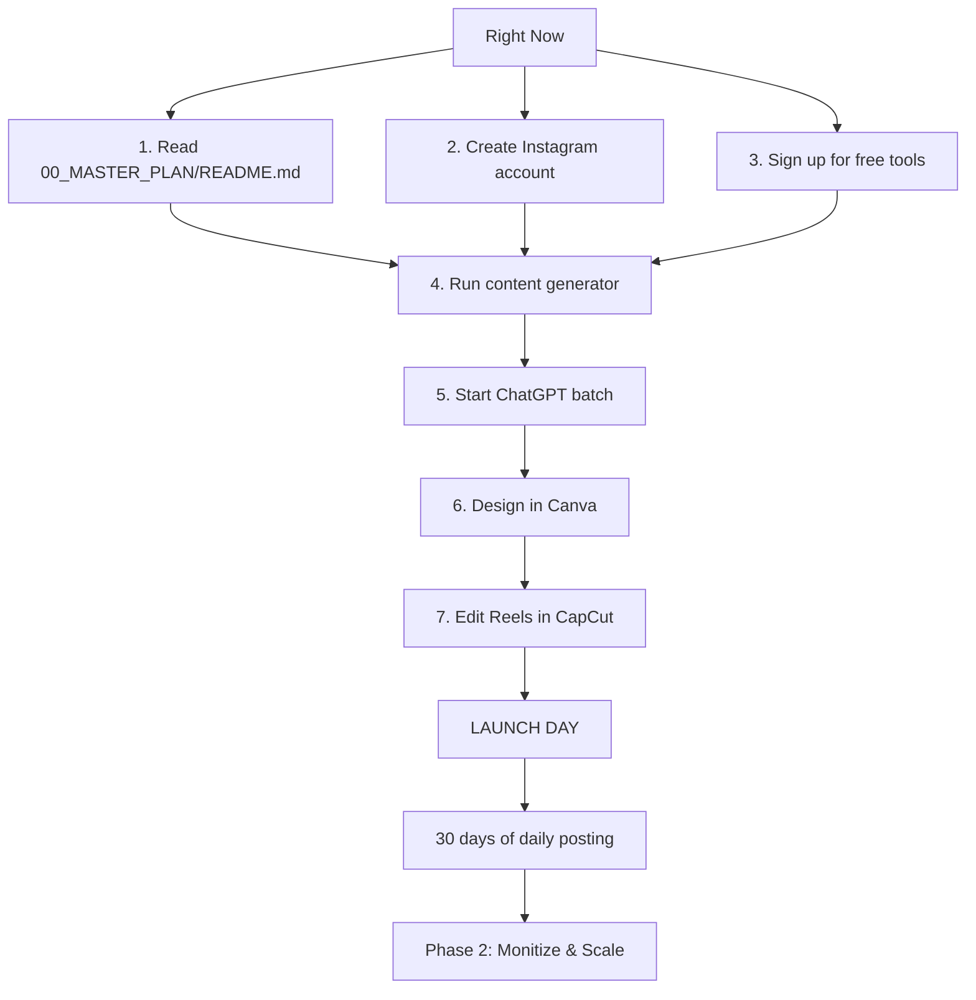

# 🏛️ Stoic Wisdom × Zodiac Signs — Project Index

**Operator**: Marc | **Role**: Elite Content & Automation Operator  
**Phase**: 1 — Basic Setup | **Launch Window**: 30 Days

---

## 📁 Project Structure

```
stoiczodiac/
│
├── INDEX.md                          ← YOU ARE HERE
├── 00_MASTER_PLAN/
│   └── README.md                     ← The core blueprint (start here)
│
├── 01_BRAND_ASSETS/
│   └── brand_guidelines.md           ← Colors, fonts, voice, profile setup
│
├── 02_CONTENT_PILLARS/
│   └── content_pillars.md            ← 6 content pillars with full structures
│
├── 03_CONTENT_CALENDAR/
│   ├── week1_template.md             ← Launch week day-by-day
│   └── generated/
│       ├── content_calendar_20260810.csv  ← 30-day calendar (CSV)
│       └── content_calendar_20260810.md   ← 30-day calendar (markdown)
│
├── 04_TEMPLATES/
│   ├── canva_setup_guide.md          ← Canva brand kit + 3 templates
│   ├── canva-app/                    ← Canva Developer App (React + Express)
│   ├── carousels/
│   │   └── carousel_template_guide.md  ← 4 carousel templates
│   ├── reels/
│   │   └── reel_template_guide.md      ← 3 reel templates
│   └── stories/
│
├── 05_AI_WORKFLOWS/
│   ├── prompts/
│   │   └── master_prompt_library.md  ← 10 ChatGPT prompts (copy-paste)
│   └── scripts/
│       ├── batch_content_generator.py   ← Python calendar generator
│       └── batch_content_generator.ps1  ← PowerShell version
│
├── 06_AUTOMATION/
│   ├── dm_sequences/
│   │   └── manychat_welcome_sequence.md  ← 4-message DM flow
│   └── scheduler_setup/
│       └── later_setup_guide.md          ← Later + Buffer free tier config
│
├── 07_AUDIO/
│   └── voiceover_scripts/
│       └── reel_voiceover_bank.md        ← 15 Reel scripts + production notes
│
├── 08_HASHTAG_LIBRARY/
│   └── hashtag_library.md               ← 150+ tags in 6 groups + formulas
│
├── 09_MONETIZATION/
│   └── monetization_roadmap.md          ← 5-tier monetization plan (Month 2-6)
│
├── 10_ANALYTICS/
│   └── weekly_audit_template.md         ← Weekly audit template + KPIs
│
└── _ARCHIVE/                            ← Spent/deleted content goes here
```

---

## 🚀 Launch Sequence (30 Days)

### Week 1: Foundation (Days 1–7)
| Day | Action | Files Needed |
|-----|--------|-------------|
| 1 | Create IG account + Canva brand kit | `01_BRAND_ASSETS/brand_guidelines.md` |
| 1 | Generate 12 zodiac avatar images | `04_TEMPLATES/canva_setup_guide.md` |
| 2 | Build 3 Canva templates | `04_TEMPLATES/canva_setup_guide.md` |
| 2 | (Optional) Set up Canva Dev App | `04_TEMPLATES/canva-app/README.md` |
| 2 | Generate 30 quotes via ChatGPT | `05_AI_WORKFLOWS/prompts/master_prompt_library.md` → Prompt 1 |
| 3 | Build hashtag library | `08_HASHTAG_LIBRARY/hashtag_library.md` |
| 4 | Design 30 quote images | Canva template batch |
| 5 | Set up Later scheduler | `06_AUTOMATION/scheduler_setup/later_setup_guide.md` |
| 5-6 | Edit 3 Reels | `07_AUDIO/voiceover_scripts/reel_voiceover_bank.md` + CapCut |
| 6 | Set up ManyChat DM flow | `06_AUTOMATION/dm_sequences/manychat_welcome_sequence.md` |
| **7** | **LAUNCH DAY** | `03_CONTENT_CALENDAR/week1_template.md` |

### Week 2: Build Momentum (Days 8–14)
- Post daily (calendar generated)
- 30 min/day engagement in niche hashtags
- 2 carousels, 3 Reels, 1 weekly forecast
- Track analytics

### Week 3: Growth Systems (Days 15–21)
- Maintain daily posting
- Audit top-5 posts → iterate
- DM automation active
- 3 collab requests

### Week 4: Scale & Optimize (Days 22–30)
- Double down on top formats
- Reels → 5x/week
- Launch first Story poll
- Analytics review
- **Day 30**: Retrospective → Phase 2

---

## 🧰 Free AI Tool Stack Quick Reference

| Tool | Free Tier | Setup Status |
|------|-----------|-------------|
| **ChatGPT** (GPT-3.5) | Unlimited | ✅ Ready |
| **Canva** | 250K+ templates | Needs setup |
| **Leonardo AI** | 150 credits/day | Needs signup |
| **CapCut Desktop** | Full suite | Needs install |
| **ElevenLabs** | 10K chars/month | Needs signup |
| **Pexels** | Unlimited | ✅ Ready |
| **Later** | 30 posts/month | Needs signup |
| **ManyChat** | 1K contacts | Needs signup |
| **Gumroad** | Free (10% fee) | For PDF sales |
| **Substack** | Free | For newsletter |

---

## 📊 Target KPIs (End of 30 Days)

| Metric | Target | How to Track |
|--------|--------|-------------|
| Followers | 500–1,000 | Instagram Insights |
| Avg. Post Reach | 500+ | Instagram Insights |
| Avg. Reel Views | 1,000+ | Instagram Insights |
| Engagement Rate | 5%+ | `(L+C+S+Sh) / Reach × 100` |
| Story Views | 100+ | Instagram Insights |
| DM Conversations | 50+ | ManyChat Dashboard |
| Saved Posts | 20+/post | Instagram Insights |

---

## ⚡ Where to Start RIGHT NOW



---

## 🏁 Phase 2 Preview (After 30 Days)

- **Scale**: 2 accounts (Stoic × Zodiac + one more niche)
- **Monetize**: PDF journal, readings, affiliate, sponsorships
- **Automate**: Full ManyChat flows, auto-DM, content repurposing
- **Grow**: Collab loops, cross-promotion, TikTok expansion

---

**Next action**: Open `00_MASTER_PLAN/README.md` and start the checklist.